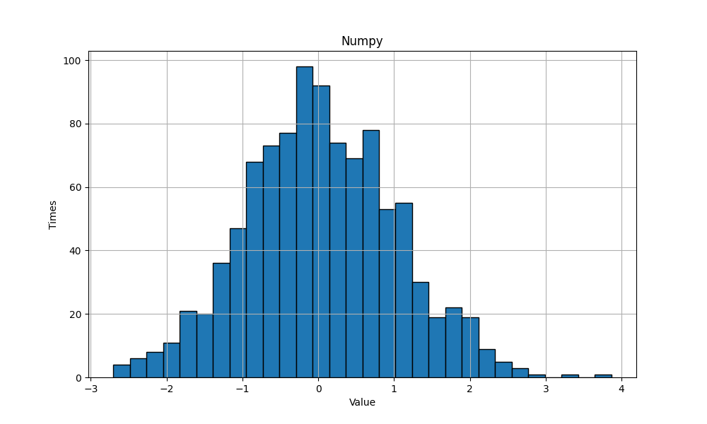
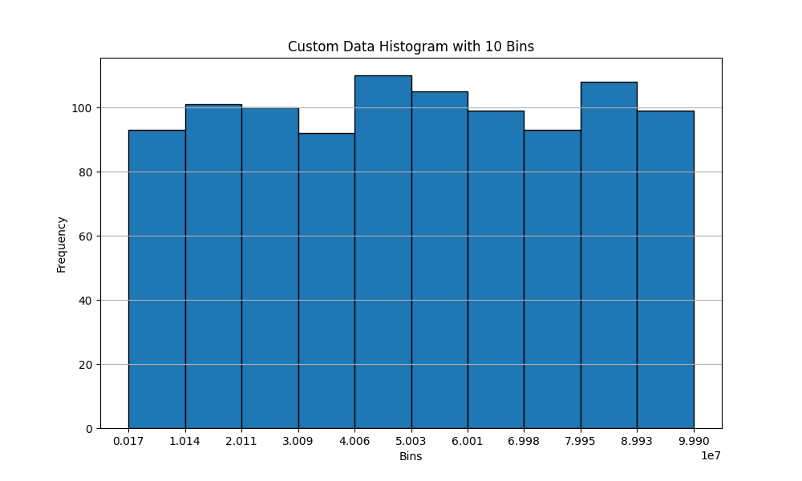

<div align=center>

<h1>DRandom</h1>
<h3>(DaYe Random Number Generator)</h3>
A purely mathematical random number generator
</div>

## Numpy Random Number Generator

We use the following code to visualize the 1000 random numbers generated by numpy.

```python
import matplotlib.pyplot as plt
import numpy as np
 
data = np.random.randn(1000)
plt.figure(figsize=(10, 6))  
plt.hist(data, bins=30, edgecolor='black') 
plt.title('Numpy')
plt.xlabel('Value')
plt.ylabel('Times')
plt.grid(True)
plt.show()
```
Finally, this frequency distribution histogram was obtained.



It can be seen that the random numbers obtained through the algorithm used by numpy are concentrated within a certain range. 

The probability of the number generated by the true random number generator falling on each interval should be equal, so the image of the true random number should be flatter, rather than having such an obvious peak.

## DaYe Random Number Generator

The image of random numbers generated using DaYe Random Number Generator is like this.



Obviously, the distribution of this set of random numbers is more consistent with statistical principles.

We can compare the differences more intuitively through the figure below.

| **Numpy**                | **DaYe Random Number Generator**   |
|--------------------------|---------------|
|  |  |

## How To Use
```python
import drandom    #import drandom

drandom.run()     #launch drandom

value = drandom.get()      #generat a random number
print(f"\033[1;42m {value} \033[0m")
```
Running this code will output an unpredictable random number.

## Attention⚠️

Do not let drandom generate random numbers continuously, otherwise continuous repetition will occur. 

If you want to generate continuous random numbers, you can try the following method.

```python
import time
import drandom

drandom.run() 
delay = 0.1

if __name__ == '__main__':
    for i in range(1000):
        time.sleep(delay)      #wait 0.1s
        value = drandom.get()
        print(f"\033[1;42m {value} \033[0m")
```

## Copyright & License ⚖

Copyright © 2021.DaYe 

<p xmlns:cc="http://creativecommons.org/ns#" xmlns:dct="http://purl.org/dc/terms/"><a property="dct:title" rel="cc:attributionURL" href=#>DaYe Random Number Generator</a> by <a rel="cc:attributionURL dct:creator" property="cc:attributionName" href="https://www.dyblog.online/">DaYe</a> is licensed under <a href="https://creativecommons.org/licenses/by-nc-sa/4.0/?ref=chooser-v1" target="_blank" rel="license noopener noreferrer" style="display:inline-block;">CC BY-NC-SA 4.0</a></p>

